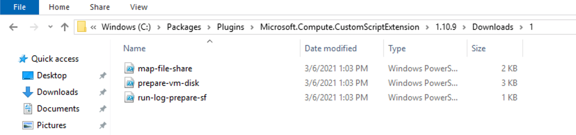
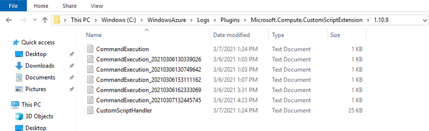
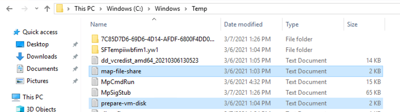

# vmss-extensions

## Purpose

We are using these powershell script to prepare a VM or a VMSS for a Service Fabric installation.
Service Fabric by default uses TEMP storage for the installation and at minimum 16 / 20 GB. in PROD we have a VMSS with 75GB temp storage.

For Development this is not needed. we are using an attached disk and Service Fabric configuration on the attached disk to choose another cheaper and smaller Compute.


## Solution

We are using Custom Script Extensions to execute powershell script on the VM or every VM of the VMSS
https://docs.microsoft.com/en-us/azure/virtual-machines/extensions/custom-script-windows

These extension must run before Service Fabric installation. 
We are using "extension sequencing" between extension. 
https://docs.microsoft.com/en-us/azure/virtual-machine-scale-sets/virtual-machine-scale-sets-extension-sequencing

If you are using VMSS, you have to adapt your template version to use dependencies

```json
  "vmssApiVersion": "2019-07-01",
```

## Configuration of custom script extension

- Name your extension uniquely within your template here e.g. "customScriptAttachDisksFirst"
- list all your files you want to use in the "fileUris" section

for convenience of the example we are using here public github content. Better solution is a private repo with token or placing your files on a storage account and configure the exension to access it with accountName and key.
see Microsoft configuration solution for using storage accounts: [Link](https://docs.microsoft.com/en-us/azure/virtual-machines/extensions/custom-script-windows#additional-examples)

```json
  "fileUris": [
      "https://raw.githubusercontent.com/enable-jarowa/vmss-extensions/main/core/run-log-prepare-sf.ps1",
      "https://raw.githubusercontent.com/enable-jarowa/vmss-extensions/main/core/prepare-vm-disk.ps1",
      "https://raw.githubusercontent.com/enable-jarowa/vmss-extensions/main/core/map-file-share.ps1"
  ]
```

- we are using "run-log-prepare-sf.ps1" as the mail script to call the other powershell script and even writing a custom log file into the %TEMP% folder for debugging.

- now we have to define the start command using "protectedSettings" at all time. This section will be encrypted by microsoft on transit and on the VM it will be decrypted using a certificate (thumbprint) installed on every VM.


### Simple command

if you dont use any secrets to be passed you can just put the command like this

start the powershell with additional options to suppress any interactive elements

```powershell
  powershell.exe -ExecutionPolicy Unrestricted -noninteractive -nologo 
```

```json
  "protectedSettings": {
    "commandToExecute": "powershell.exe -ExecutionPolicy Unrestricted -noninteractive -nologo -file run-log-prepare-sf.ps1"
  }
```

- dont use any path to call. Microsoft will start the powershell within the extension folder where all files are downloaded.
- The files are downloaded in this folder: "C:\Packages\Plugins\Microsoft.Compute.CustomScriptExtension\1.10.9\Downloads\1"


- the Extension log files are in this folder: "C:\WindowsAzure\Logs\Plugins\Microsoft.Compute.CustomScriptExtension\1.10.9"


- your custom logs are in "C:\Windows\Temp".



```json
  {
      "name": "customScriptAttachDisksFirst",
      "properties": {
          "publisher": "Microsoft.Compute",
          "type": "CustomScriptExtension",
          "typeHandlerVersion": "1.8",
          "autoUpgradeMinorVersion": true,
          "settings": {
              "fileUris": [
                  "https://raw.githubusercontent.com/enable-jarowa/vmss-extensions/main/core/run-log-prepare-sf.ps1",
                  "https://raw.githubusercontent.com/enable-jarowa/vmss-extensions/main/core/prepare-vm-disk.ps1",
                  "https://raw.githubusercontent.com/enable-jarowa/vmss-extensions/main/core/map-file-share.ps1"
              ]
          },
          "protectedSettings": {
              "commandToExecute": "[concat('powershell.exe -ExecutionPolicy Unrestricted -noninteractive -nologo -file run-log-prepare-sf.ps1  \"', parameters('fileShare.urlToMap'), '\" \"', parameters('fileShare.shareName'), '\\', parameters('fileShare.folderName'), '\" \"', parameters('fileShare.driveToMap'), '\" \"', parameters('fileShare.accountName'), '\" \"', parameters('fileShare.key'), '\"')]"
          }
      }
  },
```

## Configure dependency within Service Fabric

```json
  {
      "name": "[concat(parameters('vmNodeType0Name'),'_ServiceFabricNode')]",
      "properties": {
          "provisionAfterExtensions": [
              "__customScriptAttachDisksFirst__"
          ],
          "type": "ServiceFabricNode",
          "autoUpgradeMinorVersion": true,
          ...
      }
  }

```

## Full Solution

```json
"virtualMachineProfile": {
    "extensionProfile": {
        "extensions": [
            {
                "name": "customScriptAttachDisksFirst",
                "properties": {
                    "publisher": "Microsoft.Compute",
                    "type": "CustomScriptExtension",
                    "typeHandlerVersion": "1.8",
                    "autoUpgradeMinorVersion": true,
                    "settings": {
                        "fileUris": [
                            "https://raw.githubusercontent.com/enable-jarowa/vmss-extensions/main/core/run-log-prepare-sf.ps1",
                            "https://raw.githubusercontent.com/enable-jarowa/vmss-extensions/main/core/prepare-vm-disk.ps1",
                            "https://raw.githubusercontent.com/enable-jarowa/vmss-extensions/main/core/map-file-share.ps1"
                        ]
                    },
                    "protectedSettings": {
                        "commandToExecute": "[concat('powershell.exe -ExecutionPolicy Unrestricted -noninteractive -nologo -file run-log-prepare-sf.ps1  \"', parameters('fileShare.urlToMap'), '\" \"', parameters('fileShare.shareName'), '\\', parameters('fileShare.folderName'), '\" \"', parameters('fileShare.driveToMap'), '\" \"', parameters('fileShare.accountName'), '\" \"', parameters('fileShare.key'), '\"')]"
                    }
                }
            },
            {
                "name": "[concat(parameters('vmNodeType0Name'),'_ServiceFabricNode')]",
                "properties": {
                    "provisionAfterExtensions": [
                        "customScriptAttachDisksFirst"
                    ],
                    "type": "ServiceFabricNode",
                    "autoUpgradeMinorVersion": true,

```
